# theGarage Platform - Use Case Diagrams

This document contains comprehensive Mermaid use case diagrams for all four user types in the theGarage platform, designed to guide backend API development and feature implementation.

## 1. Free Applicant (Basic Job Seeker) Use Cases

```mermaid
graph TB
    FreeUser[Free Applicant]
    
    %% Authentication & Profile
    FreeUser --> Auth[Authentication System]
    Auth --> Login[Login/Signup]
    Auth --> Profile[Basic Profile Management]
    Profile --> EditProfile[Edit Personal Info]
    Profile --> ViewProfile[View Profile]
    
    %% Core Job Search Features
    FreeUser --> JobSearch[Job Search & Discovery]
    JobSearch --> BrowseJobs[Browse Available Jobs]
    JobSearch --> FilterJobs[Basic Job Filtering]
    JobSearch --> ViewJobDetails[View Job Details]
    JobSearch --> ApplyToJobs[Apply to Jobs]
    
    %% Limited Queue System
    FreeUser --> QueueSystem[Limited Queue System]
    QueueSystem --> JoinQueues[Join Up to 3 Queues]
    QueueSystem --> ViewQueueBasic[View Basic Queue Info]
    QueueSystem --> QueueRanking[View Position in Queue]
    
    %% Job Tracking
    FreeUser --> JobTracker[Basic Job Tracking]
    JobTracker --> TrackApplications[Track Application Status]
    JobTracker --> KanbanBoard[Basic Kanban Board]
    JobTracker --> ApplicationHistory[View Application History]
    
    %% Restricted Communication
    FreeUser --> Communication[Restricted Communication]
    Communication --> RespondToRecruiters[Respond to Recruiter Messages]
    Communication --> AcceptChatRequests[Accept Chat Invitations]
    
    %% Basic Analytics
    FreeUser --> Analytics[Basic Analytics]
    Analytics --> ViewBasicStats[View Basic Application Stats]
    Analytics --> ProgressTracking[Track Application Progress]
    
    %% Upgrade Prompts
    FreeUser --> UpgradePrompts[Premium Upgrade Prompts]
    UpgradePrompts --> ViewPremiumFeatures[See Premium Feature Previews]
    UpgradePrompts --> UpgradeFlow[Initiate Upgrade Process]
    
    %% Support
    FreeUser --> Support[Standard Support]
    Support --> ContactSupport[Contact Support]
    Support --> ReportIssues[Report Issues]
    Support --> FAQ[Access FAQ]
    
    %% Limitations (Backend Validations)
    QueueSystem -.-> QueueLimit{Max 3 Queues}
    QueueLimit -.-> BlockQueue[Block Additional Queue Joins]
    Communication -.-> ChatRestriction{Recruiter Initiated Only}
    ChatRestriction -.-> BlockChat[Block User-Initiated Chats]
    
    classDef freeUser fill:#ff6b35,stroke:#e55a2b,stroke-width:2px,color:#fff
    classDef limitation fill:#dc2626,stroke:#b91c1c,stroke-width:2px,color:#fff
    classDef feature fill:#0f172a,stroke:#1e293b,stroke-width:2px,color:#fff
    
    class FreeUser freeUser
    class QueueLimit,ChatRestriction,BlockQueue,BlockChat limitation
    class Auth,JobSearch,QueueSystem,JobTracker,Communication,Analytics,Support feature
```

## 2. Premium Applicant (Premium Job Seeker) Use Cases

```mermaid
graph TB
    PremiumUser[Premium Applicant]
    
    %% Enhanced Authentication & Profile
    PremiumUser --> Auth[Enhanced Authentication]
    Auth --> Login[Login/Signup]
    Auth --> Profile[Advanced Profile Management]
    Profile --> EditProfile[Edit Personal Info]
    Profile --> ProfileBoost[Profile Boost Features]
    Profile --> ExpertReviews[Expert Profile Reviews]
    Profile --> ProfileSimulation[Profile Improvement Simulation]
    
    %% Advanced Job Search
    PremiumUser --> JobSearch[Advanced Job Search]
    JobSearch --> BrowseJobs[Browse All Jobs]
    JobSearch --> AdvancedFiltering[Advanced Job Filtering]
    JobSearch --> SmartRecommendations[AI-Powered Job Recommendations]
    JobSearch --> ViewJobDetails[Detailed Job Insights]
    JobSearch --> ApplyToJobs[Apply to Jobs]
    JobSearch --> PriorityApplications[Priority Application Processing]
    
    %% Unlimited Queue System
    PremiumUser --> QueueSystem[Unlimited Queue System]
    QueueSystem --> UnlimitedQueues[Join Unlimited Queues]
    QueueSystem --> QueueIntelligence[AI Queue Intelligence]
    QueueSystem --> SmartQueueRecs[Smart Queue Recommendations]
    QueueSystem --> AdvancedAnalytics[Advanced Queue Analytics]
    QueueSystem --> LeaderboardAccess[Full Leaderboard Access]
    QueueSystem --> QueueComparison[Queue Performance Comparison]
    
    %% Enhanced Job Tracking
    PremiumUser --> JobTracker[Enhanced Job Tracking]
    JobTracker --> AdvancedKanban[Advanced Kanban Features]
    JobTracker --> PredictiveAnalytics[Predictive Success Analytics]
    JobTracker --> ApplicationInsights[Deep Application Insights]
    JobTracker --> InterviewPrediction[Interview Probability Tracking]
    
    %% Full Communication Access
    PremiumUser --> Communication[Full Communication Access]
    Communication --> InitiateChats[Initiate Chats with Recruiters]
    Communication --> CoffeeChatRequests[Request Coffee Chats]
    Communication --> PriorityMessaging[Priority Message Response]
    Communication --> AdvancedNetworking[Advanced Networking Tools]
    
    %% Premium Analytics & Insights
    PremiumUser --> Analytics[Premium Analytics Dashboard]
    Analytics --> AdvancedMetrics[Advanced Performance Metrics]
    Analytics --> MarketInsights[Job Market Insights]
    Analytics --> CompetitorAnalysis[Profile Comparison with Others]
    Analytics --> TrendAnalysis[Industry Trend Analysis]
    Analytics --> SuccessPrediction[Success Probability Modeling]
    
    %% Premium Support
    PremiumUser --> Support[Priority Support]
    Support --> PrioritySupport[24/7 Priority Support]
    Support --> DedicatedSupport[Dedicated Support Agent]
    Support --> CareerCoaching[Career Coaching Sessions]
    Support --> ResumeReview[Professional Resume Review]
    
    %% Premium Features
    PremiumUser --> PremiumFeatures[Exclusive Premium Features]
    PremiumFeatures --> ProfileVisibility[Enhanced Profile Visibility]
    PremiumFeatures --> RecruiterInsights[Recruiter Behavior Insights]
    PremiumFeatures --> ApplicationTracking[Advanced Application Tracking]
    PremiumFeatures --> SkillAssessments[Premium Skill Assessments]
    
    classDef premiumUser fill:#ffd700,stroke:#f59e0b,stroke-width:3px,color:#000
    classDef premiumFeature fill:#0f172a,stroke:#ff6b35,stroke-width:2px,color:#fff
    classDef aiFeature fill:#8b5cf6,stroke:#7c3aed,stroke-width:2px,color:#fff
    
    class PremiumUser premiumUser
    class Auth,JobSearch,QueueSystem,JobTracker,Communication,Analytics,Support,PremiumFeatures premiumFeature
    class SmartRecommendations,QueueIntelligence,SmartQueueRecs,PredictiveAnalytics,SuccessPrediction aiFeature
```

## 3. Regular Recruiter Use Cases

```mermaid
graph TB
    RegularRecruiter[Regular Recruiter]
    
    %% Authentication & Profile
    RegularRecruiter --> Auth[Recruiter Authentication]
    Auth --> Login[Login/Signup with Company]
    Auth --> RecruiterProfile[Recruiter Profile Management]
    RecruiterProfile --> EditRecruiterProfile[Edit Professional Profile]
    RecruiterProfile --> CompanyInfo[Manage Company Information]
    RecruiterProfile --> SkillsExpertise[Define Recruitment Expertise]
    
    %% Job Management
    RegularRecruiter --> JobManagement[Job Management System]
    JobManagement --> PostJobs[Post New Job Openings]
    JobManagement --> EditJobs[Edit Existing Jobs]
    JobManagement --> JobAnalytics[View Job Performance Analytics]
    JobManagement --> QueueSelection[Select Target Queues for Jobs]
    JobManagement --> ApplicationReview[Review Applications]
    
    %% Candidate Management
    RegularRecruiter --> CandidateManagement[Candidate Management]
    CandidateManagement --> BrowseCandidates[Browse Available Candidates]
    CandidateManagement --> QueueSourcing[Source from Job Queues]
    CandidateManagement --> CandidateProfiles[View Detailed Candidate Profiles]
    CandidateManagement --> CandidateRanking[Rank and Filter Candidates]
    CandidateManagement --> ShortlistCandidates[Create Shortlists]
    
    %% Communication & Outreach
    RegularRecruiter --> Communication[Candidate Communication]
    Communication --> InitiateChats[Initiate Conversations]
    Communication --> SendConsiderations[Send Consideration Requests]
    Communication --> ScheduleInterviews[Schedule Interview Calls]
    Communication --> MessageTracking[Track Communication History]
    Communication --> ResponseTracking[Monitor Response Rates]
    
    %% Interview Management
    RegularRecruiter --> InterviewSystem[Interview Management]
    InterviewSystem --> InterviewCalendar[Manage Interview Calendar]
    InterviewSystem --> ScheduleInterview[Schedule New Interviews]
    InterviewSystem --> InterviewNotes[Record Interview Notes]
    InterviewSystem --> CandidateEvaluation[Evaluate Candidates]
    InterviewSystem --> InterviewFeedback[Provide Interview Feedback]
    
    %% Analytics & Reporting
    RegularRecruiter --> Analytics[Recruitment Analytics]
    Analytics --> RecruitmentMetrics[Track Recruitment KPIs]
    Analytics --> SourceEffectiveness[Analyze Sourcing Effectiveness]
    Analytics --> TimeToHire[Monitor Time-to-Hire Metrics]
    Analytics --> CandidateConversion[Track Conversion Rates]
    Analytics --> TeamPerformance[View Individual Performance]
    
    %% Notifications & Updates
    RegularRecruiter --> Notifications[Notification System]
    Notifications --> ApplicationAlerts[New Application Notifications]
    Notifications --> CandidateUpdates[Candidate Status Updates]
    Notifications --> InterviewReminders[Interview Reminders]
    Notifications --> SystemNotifications[Platform Updates]
    
    %% Limited Institution Access
    RegularRecruiter --> InstitutionAccess[Limited Institution Access]
    InstitutionAccess --> ViewTeamMembers[View Team Members]
    InstitutionAccess --> ViewInstitutionStats[View Institution Statistics]
    InstitutionAccess --> JoinInstitution[Join Existing Institution]
    
    %% Restrictions (Backend Validations)
    InstitutionAccess -.-> AdminRestriction{Admin-Only Features}
    AdminRestriction -.-> BlockAdmin[Block Administrative Actions]
    JobManagement -.-> JobLimit{Institution Job Limits}
    JobLimit -.-> EnforceLimit[Enforce Posting Limits]
    
    classDef regularRecruiter fill:#0f172a,stroke:#1e293b,stroke-width:2px,color:#fff
    classDef restriction fill:#dc2626,stroke:#b91c1c,stroke-width:2px,color:#fff
    classDef feature fill:#ff6b35,stroke:#e55a2b,stroke-width:2px,color:#fff
    
    class RegularRecruiter regularRecruiter
    class AdminRestriction,BlockAdmin,JobLimit,EnforceLimit restriction
    class Auth,JobManagement,CandidateManagement,Communication,InterviewSystem,Analytics,Notifications feature
```

## 4. Admin Recruiter Use Cases

```mermaid
graph TB
    AdminRecruiter[Admin Recruiter]
    
    %% Enhanced Authentication & Profile
    AdminRecruiter --> Auth[Admin Authentication System]
    Auth --> AdminLogin[Admin Login/Signup]
    Auth --> AdminProfile[Admin Profile Management]
    AdminProfile --> EditAdminProfile[Edit Administrative Profile]
    AdminProfile --> AdminPermissions[Manage Admin Permissions]
    AdminProfile --> SystemAccess[System-Level Access Controls]
    
    %% Institution Management
    AdminRecruiter --> InstitutionMgmt[Institution Management]
    InstitutionMgmt --> CreateInstitution[Create New Institution]
    InstitutionMgmt --> InstitutionSettings[Configure Institution Settings]
    InstitutionMgmt --> BrandingManagement[Manage Institution Branding]
    InstitutionMgmt --> InstitutionAnalytics[Institution-Wide Analytics]
    InstitutionMgmt --> PolicyManagement[Set Recruitment Policies]
    
    %% Team & User Management
    AdminRecruiter --> TeamManagement[Team Management System]
    TeamManagement --> InviteRecruiters[Invite Team Members]
    TeamManagement --> ManagePermissions[Assign Role Permissions]
    TeamManagement --> TeamPerformance[Monitor Team Performance]
    TeamManagement --> UserProvisioning[User Account Provisioning]
    TeamManagement --> AccessControl[Manage Access Controls]
    TeamManagement --> TeamAnalytics[Team Analytics Dashboard]
    
    %% Advanced Job Management
    AdminRecruiter --> JobManagement[Advanced Job Management]
    JobManagement --> UnlimitedJobPosts[Unlimited Job Postings]
    JobManagement --> JobTemplates[Create Job Templates]
    JobManagement --> BulkJobManagement[Bulk Job Operations]
    JobManagement --> JobApprovalWorkflow[Job Approval Workflows]
    JobManagement --> JobAnalyticsDashboard[Comprehensive Job Analytics]
    
    %% Enterprise Candidate Management
    AdminRecruiter --> CandidateManagement[Enterprise Candidate Management]
    CandidateManagement --> CandidateDatabase[Centralized Candidate Database]
    CandidateManagement --> AdvancedSourcing[Advanced Sourcing Tools]
    CandidateManagement --> CandidatePipeline[Manage Recruitment Pipeline]
    CandidateManagement --> TalentPool[Build Talent Pools]
    CandidateManagement --> CandidateTagging[Advanced Candidate Tagging]
    
    %% Administrative Communication
    AdminRecruiter --> AdminCommunication[Administrative Communication]
    AdminCommunication --> SystemAnnouncements[Send System Announcements]
    AdminCommunication --> TeamMessaging[Team-Wide Messaging]
    AdminCommunication --> PolicyUpdates[Communicate Policy Changes]
    AdminCommunication --> TrainingCommunication[Training & Development Updates]
    
    %% System Administration
    AdminRecruiter --> SystemAdmin[System Administration]
    SystemAdmin --> UserManagement[System-Wide User Management]
    SystemAdmin --> SystemConfiguration[Platform Configuration]
    SystemAdmin --> SecurityManagement[Security & Compliance Management]
    SystemAdmin --> IntegrationManagement[Third-Party Integrations]
    SystemAdmin --> BackupRecovery[Data Backup & Recovery]
    
    %% Advanced Analytics & Reporting
    AdminRecruiter --> Analytics[Enterprise Analytics]
    Analytics --> ExecutiveDashboard[Executive Dashboard]
    Analytics --> ROIAnalytics[Recruitment ROI Analysis]
    Analytics --> ComplianceReporting[Compliance & Audit Reports]
    Analytics --> PredictiveAnalytics[Predictive Recruitment Analytics]
    Analytics --> BenchmarkingReports[Industry Benchmarking]
    Analytics --> CustomReports[Custom Report Generation]
    
    %% Financial Management
    AdminRecruiter --> FinancialMgmt[Financial Management]
    FinancialMgmt --> BillingManagement[Billing & Subscription Management]
    FinancialMgmt --> CostAnalysis[Recruitment Cost Analysis]
    FinancialMgmt --> BudgetManagement[Budget Planning & Management]
    FinancialMgmt --> VendorManagement[Vendor & Contract Management]
    
    %% Compliance & Security
    AdminRecruiter --> Compliance[Compliance & Security]
    Compliance --> DataPrivacy[Data Privacy Management]
    Compliance --> AuditTrails[Comprehensive Audit Trails]
    Compliance --> ComplianceReporting[Compliance Reporting]
    Compliance --> SecurityPolicies[Security Policy Enforcement]
    Compliance --> RiskManagement[Risk Assessment & Management]
    
    %% Platform Administration
    AdminRecruiter --> PlatformAdmin[Platform Administration]
    PlatformAdmin --> FeatureManagement[Feature Toggle Management]
    PlatformAdmin --> SystemMonitoring[System Health Monitoring]
    PlatformAdmin --> MaintenanceScheduling[Maintenance Scheduling]
    PlatformAdmin --> PerformanceOptimization[Performance Optimization]
    
    classDef adminRecruiter fill:#dc2626,stroke:#b91c1c,stroke-width:3px,color:#fff
    classDef adminFeature fill:#0f172a,stroke:#dc2626,stroke-width:2px,color:#fff
    classDef systemFeature fill:#7c3aed,stroke:#6d28d9,stroke-width:2px,color:#fff
    classDef securityFeature fill:#059669,stroke:#047857,stroke-width:2px,color:#fff
    
    class AdminRecruiter adminRecruiter
    class Auth,InstitutionMgmt,TeamManagement,JobManagement,CandidateManagement,AdminCommunication adminFeature
    class SystemAdmin,PlatformAdmin,FinancialMgmt systemFeature
    class Compliance,SecurityManagement,DataPrivacy,AuditTrails securityFeature
```

## 5. Cross-System Integration Use Cases

```mermaid
graph TB
    Platform[theGarage Platform]
    
    %% External Integrations
    Platform --> ExternalSystems[External System Integrations]
    ExternalSystems --> JobBoards[Job Board Integrations]
    ExternalSystems --> ATS[ATS System Integration]
    ExternalSystems --> HRIS[HRIS Integration]
    ExternalSystems --> EmailSystems[Email Service Integration]
    ExternalSystems --> CalendarSystems[Calendar System Integration]
    ExternalSystems --> VideoConferencing[Video Conferencing Integration]
    ExternalSystems --> PaymentGateways[Payment Gateway Integration]
    
    %% Data Management
    Platform --> DataManagement[Data Management System]
    DataManagement --> UserDataSync[User Data Synchronization]
    DataManagement --> BackupSystems[Automated Backup Systems]
    DataManagement --> DataMigration[Data Migration Tools]
    DataManagement --> DataAnalytics[Advanced Data Analytics]
    DataManagement --> DataCompliance[Data Compliance Management]
    
    %% API Management
    Platform --> APIManagement[API Management System]
    APIManagement --> RESTAPIs[RESTful API Services]
    APIManagement --> WebhookSystem[Webhook Management]
    APIManagement --> APIAuthentication[API Authentication & Authorization]
    APIManagement --> RateLimiting[API Rate Limiting]
    APIManagement --> APIMonitoring[API Performance Monitoring]
    
    %% Notification Systems
    Platform --> NotificationSystems[Multi-Channel Notifications]
    NotificationSystems --> EmailNotifications[Email Notification Service]
    NotificationSystems --> PushNotifications[Push Notification Service]
    NotificationSystems --> SMSNotifications[SMS Notification Service]
    NotificationSystems --> InAppNotifications[In-App Notification System]
    
    %% AI & Machine Learning
    Platform --> AIServices[AI & ML Services]
    AIServices --> RecommendationEngine[Job Recommendation Engine]
    AIServices --> ProfileMatching[Profile Matching Algorithm]
    AIServices --> PredictiveAnalytics[Predictive Analytics Engine]
    AIServices --> NLPServices[Natural Language Processing]
    AIServices --> ChatbotIntegration[AI Chatbot Integration]
    
    classDef platform fill:#ff6b35,stroke:#e55a2b,stroke-width:3px,color:#fff
    classDef integration fill:#0f172a,stroke:#1e293b,stroke-width:2px,color:#fff
    classDef aiService fill:#8b5cf6,stroke:#7c3aed,stroke-width:2px,color:#fff
    
    class Platform platform
    class ExternalSystems,DataManagement,APIManagement,NotificationSystems integration
    class AIServices,RecommendationEngine,ProfileMatching,PredictiveAnalytics,NLPServices,ChatbotIntegration aiService
```

## Backend API Design Implications

Based on these use cases, the backend should implement:

### 1. **Authentication & Authorization Service**
- Role-based access control (RBAC)
- JWT token management
- Session management
- Multi-factor authentication
- Institution-based permissions

### 2. **User Management Service**
- User profile management
- Subscription management
- Premium feature gating
- User preference management

### 3. **Job Management Service**
- Job posting and editing
- Job search and filtering
- Application tracking
- Job analytics and reporting

### 4. **Queue Management Service**
- Queue creation and management
- User queue assignments
- Queue analytics and rankings
- Queue-based recommendations

### 5. **Communication Service**
- Real-time messaging
- Email notifications
- Chat history management
- Communication preferences

### 6. **Analytics Service**
- User behavior tracking
- Performance metrics
- Predictive analytics
- Custom reporting

### 7. **Institution Management Service**
- Institution creation and management
- Team member management
- Permission management
- Institution analytics

### 8. **Payment & Subscription Service**
- Subscription management
- Payment processing
- Billing and invoicing
- Usage tracking

### 9. **Notification Service**
- Multi-channel notifications
- Notification preferences
- Real-time updates
- Scheduled notifications

### 10. **Integration Service**
- Third-party integrations
- Webhook management
- Data synchronization
- API gateway management

Each service should be designed with proper rate limiting, caching, monitoring, and security measures appropriate for the user type and their subscription level.